<div align="center">

# 🏠 EdigKop — Chatbot WhatsApp Koperasi Desa Merah Putih

**Layanan koperasi desa lewat WhatsApp — dari aktivasi anggota, simpanan, SHU, pinjaman, e-RAT & voting, sampai pre-order barang. Cukup dari chat, tanpa aplikasi tambahan.**

Hybrid **menu + AI** · mendukung **suara (voice note)** & **foto KTP (OCR)** · dibangun untuk inklusi digital desa.


</div>

---

## 📑 Daftar Isi

1. [Tentang Proyek](#-tentang-proyek)
2. [Fitur Utama](#-fitur-utama)
3. [Arsitektur & Tech Stack](#️-arsitektur--tech-stack)
4. [Alur Penggunaan (Panduan Layar demi Layar)](#-alur-penggunaan-panduan-layar-demi-layar)
   - [A. Layar Pembuka](#a-layar-pembuka-mulai)
   - [B. Calon Anggota (Belum Aktivasi)](#b-calon-anggota--belum-aktivasi)
   - [C. Aktivasi Akun](#c-aktivasi-akun)
   - [D. Menu Utama Anggota](#d-menu-utama-anggota)
   - [E. 15 Menu Anggota](#e-15-menu-anggota-satu-per-satu)
   - [F. Alur Transaksi & Aksi](#f-alur-transaksi--aksi)
   - [G. Fitur Suara (Voice Note → Aksi)](#g-fitur-suara-voice-note--aksi)
5. [Instalasi & Menjalankan](#-instalasi--menjalankan)
6. [Konfigurasi (.env)](#-konfigurasi-env)
7. [Deploy 24/7](#-deploy-247)
8. [Struktur Proyek](#-struktur-proyek)
9. [Keamanan (OWASP & UU PDP)](#-keamanan-owasp--uu-pdp)
10. [Dokumentasi Lain](#-dokumentasi-lain)
11. [Catatan / Disclaimer](#️-catatan--disclaimer)

---

## 🎯 Tentang Proyek

**EdigKop** adalah chatbot **WhatsApp** untuk **Koperasi Desa/Kelurahan Merah Putih (KOPDES)**. Tujuannya sederhana: membawa seluruh layanan koperasi ke kanal yang **sudah dimiliki dan dipakai sehari-hari** oleh warga desa — WhatsApp — sehingga tidak perlu unduh aplikasi baru, tidak perlu datang ke kantor untuk hal-hal rutin, dan ramah untuk warga yang kurang melek teknologi.

**Masalah yang diselesaikan:**

- 🧑‍🌾 **Jarak & waktu** — warga desa sering jauh dari kantor koperasi; urusan simpanan/SHU/pinjaman butuh datang langsung.
- 📱 **Hambatan aplikasi** — install & belajar aplikasi baru itu berat bagi sebagian warga. WhatsApp sudah familiar.
- ✍️ **Hambatan mengetik** — warga yang tidak nyaman mengetik bisa **kirim pesan suara**; bot mentranskripsi & menindaklanjuti.
- 🪪 **Pendaftaran ribet** — cukup **foto KTP**, data terisi otomatis lewat OCR.
- 🗳️ **Partisipasi** — e-RAT & voting bisa dilakukan **online langsung dari chat**, meningkatkan keterlibatan anggota.

**Pendekatan *hybrid*:** setiap pesan masuk diproses berjenjang → **menu/kata kunci (rule-based)** → **deteksi maksud (intent AI)** untuk kalimat bebas → **ngobrol dengan asisten AI**. Jadi anggota tidak harus hafal perintah — cukup ketik/ucapkan dengan bahasa sendiri.

> Semua data, nomor anggota, dan pembayaran dalam demo ini bersifat **dummy/simulasi** (MVP Hackathon). Tidak ada transaksi keuangan nyata. Backend produksi (SIMKOPDES, DB nasional) tinggal dicolokkan lewat konfigurasi tanpa mengubah alur.

---

## ✨ Fitur Utama

| Kategori | Fitur |
|---|---|
| 👤 **Onboarding** | Welcome card berlogo, penjelasan koperasi, simulasi keuntungan, periksa aktivasi anggota lama |
| 🪪 **Aktivasi** | Aktivasi **kilat** (demo), **form 12 langkah**, atau **OCR foto KTP** (14 field otomatis) |
| 💰 **Keuangan Anggota** | Informasi diri, Simpanan (pokok/wajib/sukarela), Estimasi SHU, Info Pinjaman, Ringkasan Keuangan |
| 💳 **Setor Simpanan** | Instruksi Virtual Account + konfirmasi pembayaran (simulasi) + reward poin |
| 🗳️ **e-RAT & Voting** | Info Rapat Anggota Tahunan + **surat suara digital** dengan rekap hasil & kuorum real-time |
| 🎯 **Gamifikasi** | Poin, lencana, skor keterlibatan, misi mingguan |
| 🤝 **Referral "Gotong Royong"** | Kode ajakan + poin bonus SHU untuk tiap teman yang aktivasi |
| 📦 **Pre-Order (PO)** | Form pemesanan barang → penawaran admin (harga + DP + estimasi) ke produsen |
| 📢 **Informasi** | Daftar pengurus, pengumuman, Anggota Jaga Anggota, **data koperasi nasional (read-only)** |
| 🤖 **Asisten AI** | Tanya-jawab bebas seputar koperasi (Groq / Claude / Gemini / Vertex) |
| 🎤 **Multimodal** | **Voice note → aksi** (STT Bahasa Indonesia) & **foto KTP → OCR** |
| 🔔 **Proaktif** | Broadcast/push notifikasi (voting, nudge re-aktivasi) untuk admin |

---

## 🏗️ Arsitektur & Tech Stack

```
                       ┌─────────────────────────────┐
   WhatsApp  ◀────────▶│  Baileys (WhatsApp Web)     │
  (chat / VN / foto)   │            │                │
                       │            ▼                │
                       │   router.ts (hybrid)        │
                       │   menu → intent AI → chat   │
                       │      │        │       │      │
                       │      ▼        ▼       ▼      │
                       │  fitur     AI SDK   STT/OCR  │   ← Groq · Claude · Gemini/Vertex
                       │ (simpanan, │        (GCP)    │     (auto-fallback ke Groq)
                       │  PO, RAT,  │                 │
                       │  referral) ▼                 │
                       │      Cloud SQL (Postgres)    │   ← fallback: data dummy in-memory
                       └─────────────┬───────────────┘
                                     │  (Supabase, read)
                                     ▼
                          Dashboard Web (React + Vite)
```

| Lapisan | Teknologi |
|---|---|
| **Bahasa / Runtime** | TypeScript (ESM) · **Bun** `>=1.2` (jalankan `.ts` langsung, tanpa build) |
| **Integrasi WhatsApp** | [`@whiskeysockets/baileys`](https://github.com/WhiskeySockets/Baileys) — WhatsApp Web, login via QR |
| **AI / LLM** | **Groq** (default, OpenAI-compatible) · **Anthropic Claude** · **Google Gemini** (API key) · **Vertex AI** (service account, pakai credit GCP) — **bisa ganti saat runtime + auto-fallback ke Groq** |
| **Suara (STT)** | Google Cloud **Speech-to-Text** (voice note → teks, `id-ID`) |
| **KTP (OCR)** | Google Cloud **Vision** (ekstraksi data KTP) |
| **Database (bot)** | Google **Cloud SQL** (PostgreSQL) — *fallback* aman ke data dummy in-memory bila kosong |
| **Database (dashboard)** | Supabase |
| **Data nasional** | DB panitia hackathon (**read-only**, untuk menu "Koperasi Global") |
| **Backend aktivasi** | Adapter **SIMKOPDES** (dummy / API pemerintah) |
| **Dashboard** | React + Vite + TypeScript |
| **Utilitas** | pino (logging) · dotenv (config) · qrcode-terminal (QR login) |

---

## 📱 Alur Penggunaan (Panduan Layar demi Layar)

> Semua tangkapan layar di bawah adalah percakapan nyata dengan bot (kontak **"Edig Daya"**). Urutannya mengikuti perjalanan pengguna dari pertama kali chat sampai jadi anggota aktif.

### A. Layar Pembuka (`mulai`)

Pengguna cukup mengirim **`mulai`**. Bot membalas **welcome card** berlogo *KOPDES Merah Putih* berisi 5 pilihan bernomor — jelas, ramah, dan mengarahkan aksi berikutnya.

<table>
<tr>
<td width="300" valign="top">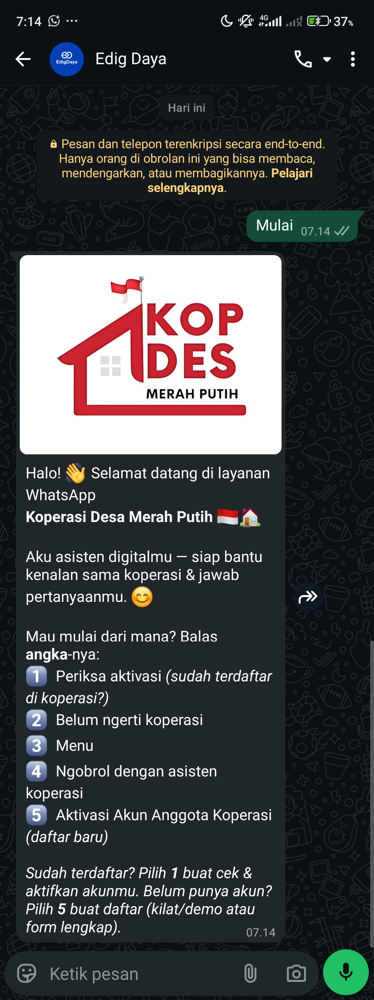</td>
<td valign="top">

**Welcome Card**

- Logo koperasi + sapaan hangat.
- 5 opsi bernomor — cukup balas **angka**:
  1. **Periksa aktivasi** (sudah terdaftar?)
  2. **Belum ngerti koperasi** (penjelasan)
  3. **Menu**
  4. **Ngobrol** dengan asisten
  5. **Aktivasi akun** (daftar baru)
- Arahan cerdas: *"Sudah terdaftar? Pilih 1. Belum punya akun? Pilih 5."*

</td>
</tr>
</table>

### B. Calon Anggota — Belum Aktivasi

Sebelum aktivasi, tiap opsi welcome card memberi jalur yang aman & mendidik. Menu inti tetap **terkunci** sampai aktivasi (mendorong pendaftaran).

<table>
<tr>
<td width="33%" valign="top">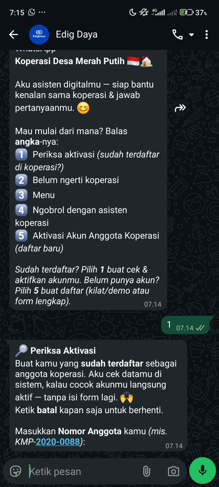<br><b>Opsi 1 — Periksa Aktivasi</b><br>Untuk anggota lama: masukkan <b>No. Anggota</b> (mis. <code>KMP-2020-0088</code>); bila cocok, akun langsung aktif tanpa isi form.</td>
<td width="33%" valign="top">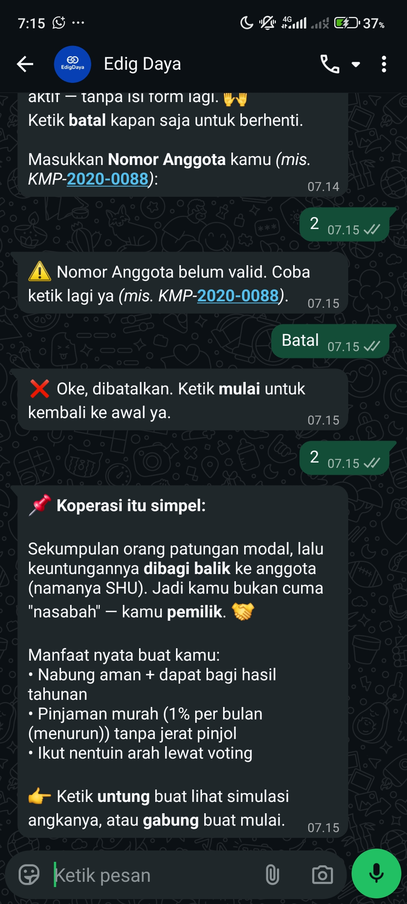<br><b>Opsi 2 — Apa itu Koperasi</b><br>Validasi input (nomor salah → diminta ulang, <code>batal</code> untuk keluar) lalu penjelasan singkat: <i>"kamu bukan nasabah — kamu pemilik"</i>, manfaat & SHU.</td>
<td width="33%" valign="top">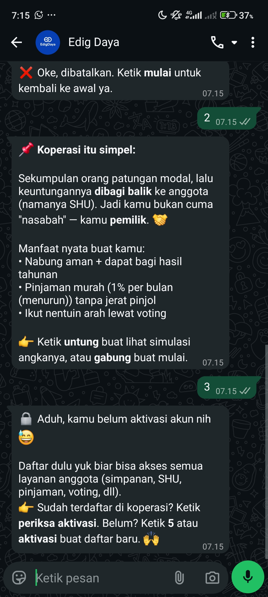<br><b>Opsi 3 — Menu (Terkunci)</b><br>Menu anggota belum bisa diakses sebelum aktivasi; bot mengarahkan ke <b>periksa aktivasi</b> atau <b>aktivasi</b>.</td>
</tr>
<tr>
<td width="33%" valign="top">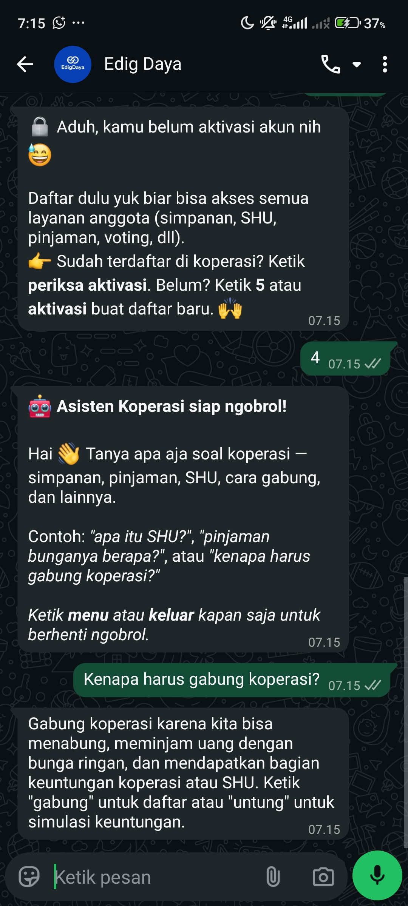<br><b>Opsi 4 — Ngobrol dengan AI</b><br>Asisten AI menjawab pertanyaan bebas (mis. <i>"kenapa harus gabung koperasi?"</i>). Ketik <code>menu</code>/<code>keluar</code> untuk berhenti.</td>
<td width="33%" valign="top">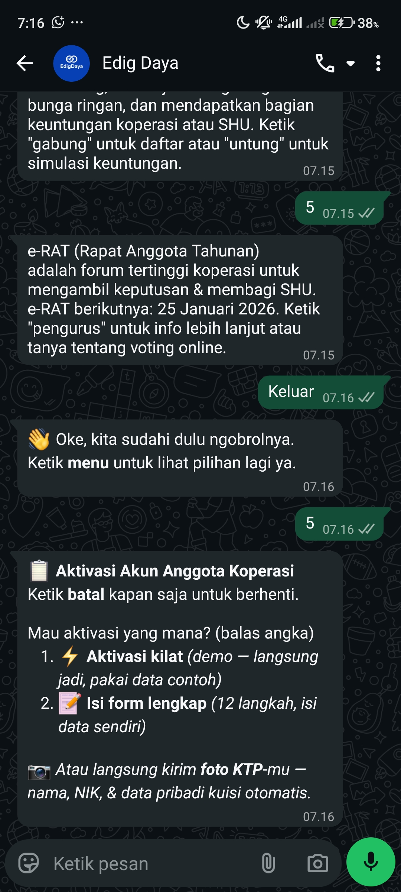<br><b>Opsi 5 — Aktivasi (Sub-menu)</b><br>Pilih jalur: <b>1)</b> Aktivasi kilat (demo), <b>2)</b> Isi form lengkap (12 langkah), atau langsung <b>kirim foto KTP</b>.</td>
<td width="33%" valign="top"></td>
</tr>
</table>

### C. Aktivasi Akun

Dua jalur cepat: **foto KTP (OCR)** atau **aktivasi kilat**. Keduanya menjaga privasi — foto KTP **tidak disimpan** (UU PDP).

<table>
<tr>
<td width="300" valign="top">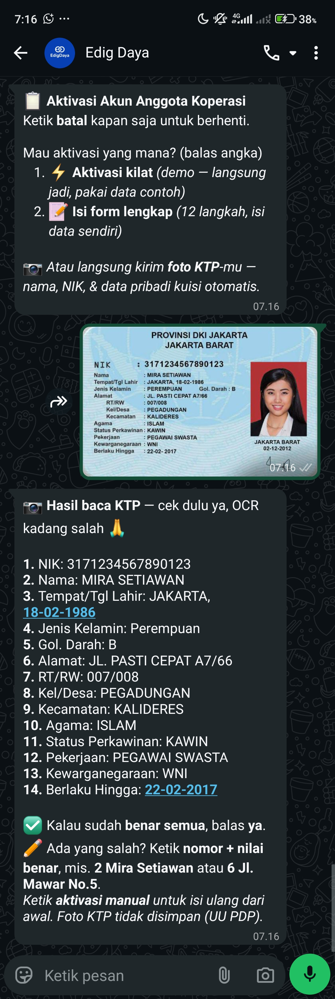</td>
<td valign="top">

**Aktivasi via Foto KTP (OCR)**

- Pengguna mengirim **foto KTP**.
- Google Vision membaca & mengisi **14 field** otomatis: NIK, Nama, Tempat/Tgl Lahir, Jenis Kelamin, Gol. Darah, Alamat, Kel/Desa, Kecamatan, Agama, Status Perkawinan, Pekerjaan, Kewarganegaraan, Berlaku Hingga.
- Bot menampilkan hasil untuk **dikonfirmasi/dikoreksi** (*"OCR kadang salah, cek dulu ya"*) → balas **`ya`** bila benar.
- 🔒 *Foto KTP tidak disimpan (UU PDP).*

</td>
</tr>
<tr>
<td width="300" valign="top">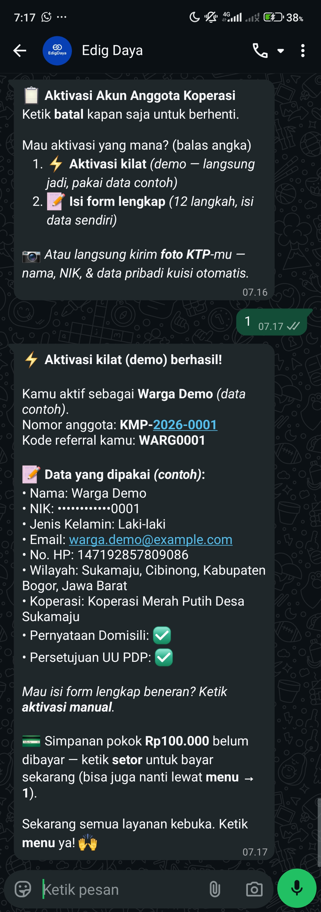</td>
<td valign="top">

**Aktivasi Kilat (Demo) Berhasil**

- Akun jadi seketika sebagai **Warga Demo** dengan **No. Anggota `KMP-2026-0001`** & **kode referral `WARG0001`**.
- Ringkasan data yang dipakai + centang **Pernyataan Domisili** & **Persetujuan UU PDP**.
- Info simpanan pokok **Rp100.000** yang belum dibayar → arahan `setor`.
- *"Sekarang semua layanan kebuka. Ketik menu ya!"*

</td>
</tr>
</table>

### D. Menu Utama Anggota

Setelah aktif, ketik **`menu`** untuk membuka **15 layanan**. Bisa dipanggil dengan **angka** atau **kata kunci**, atau sekadar **tanya bebas** (*"cara nambah simpanan?"*).

<div align="center">
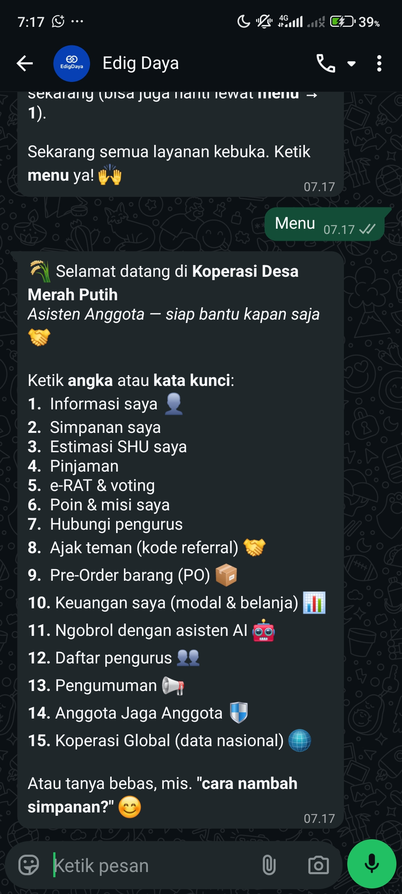
</div>

| # | Menu | # | Menu |
|---|---|---|---|
| 1 | 👤 Informasi Saya | 9 | 📦 Pre-Order Barang (PO) |
| 2 | 💰 Simpanan Saya | 10 | 📊 Keuangan Saya |
| 3 | 📈 Estimasi SHU | 11 | 🤖 Ngobrol dengan Asisten AI |
| 4 | 🏦 Pinjaman | 12 | 👥 Daftar Pengurus |
| 5 | 🗳️ e-RAT & Voting | 13 | 📢 Pengumuman |
| 6 | 🎯 Poin & Misi | 14 | 🛡️ Anggota Jaga Anggota |
| 7 | 🙋 Hubungi Pengurus | 15 | 🌐 Koperasi Global (data nasional) |
| 8 | 🤝 Ajak Teman (Referral) | | |

### E. 15 Menu Anggota (Satu per Satu)

<table>
<tr>
<td width="33%" valign="top">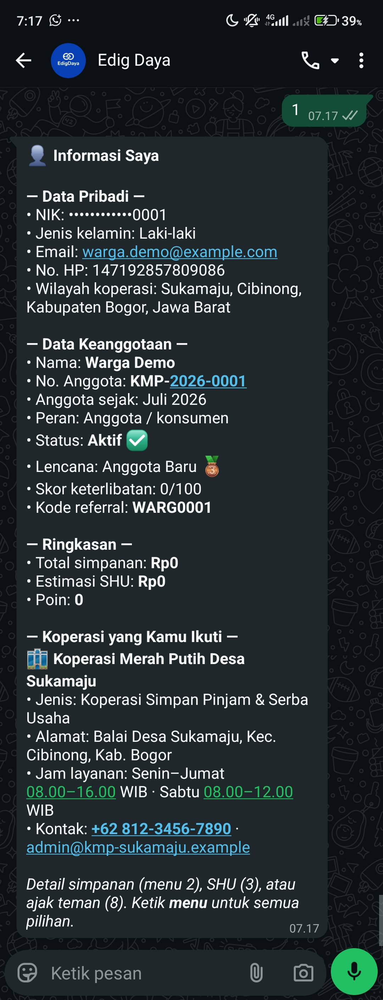<br><b>1 · Informasi Saya</b><br>Profil lengkap: data pribadi, data keanggotaan (No. Anggota, status, lencana, skor), ringkasan (simpanan/SHU/poin), & profil koperasi yang diikuti.</td>
<td width="33%" valign="top">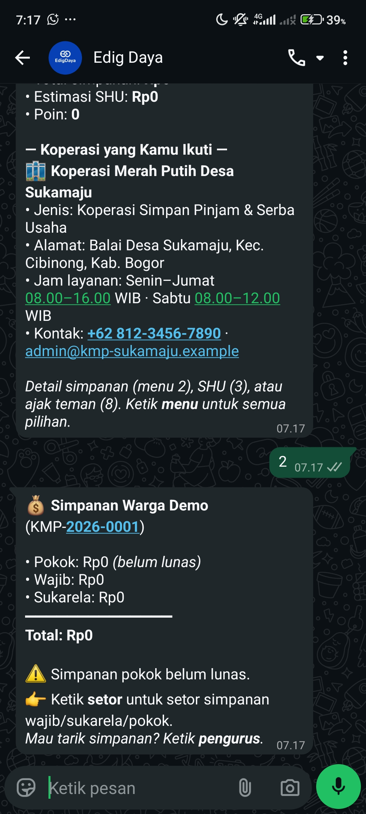<br><b>2 · Simpanan Saya</b><br>Rincian simpanan <b>Pokok / Wajib / Sukarela</b> + total. Menandai bila simpanan pokok belum lunas & arahan <code>setor</code>.</td>
<td width="33%" valign="top">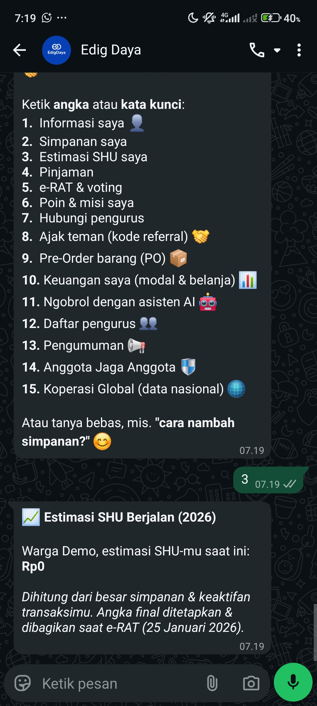<br><b>3 · Estimasi SHU</b><br>Perkiraan Sisa Hasil Usaha berjalan, dihitung dari besar simpanan & keaktifan transaksi. Angka final ditetapkan saat e-RAT.</td>
</tr>
<tr>
<td width="33%" valign="top">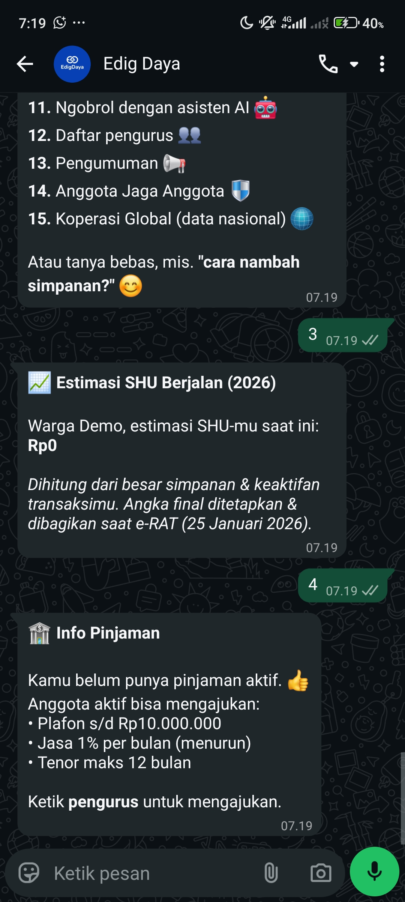<br><b>4 · Pinjaman</b><br>Status pinjaman + skema: plafon s/d <b>Rp10.000.000</b>, jasa <b>1%/bln (menurun)</b>, tenor maks <b>12 bulan</b>.</td>
<td width="33%" valign="top">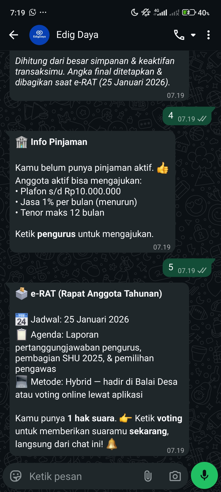<br><b>5 · e-RAT</b><br>Info Rapat Anggota Tahunan: jadwal (25 Jan 2026), agenda (LPJ, pembagian SHU, pemilihan pengawas), metode <b>hybrid</b>, & hak suara.</td>
<td width="33%" valign="top">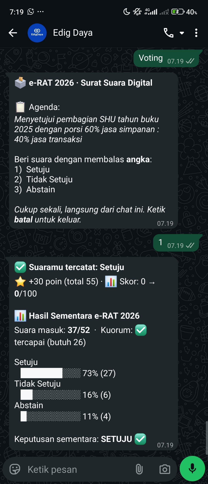<br><b>5 · Voting (Surat Suara)</b><br><b>Surat suara digital</b> → balas 1/2/3 (Setuju/Tidak/Abstain). Suara tercatat (+30 poin) + <b>rekap hasil sementara & kuorum</b> real-time.</td>
</tr>
<tr>
<td width="33%" valign="top">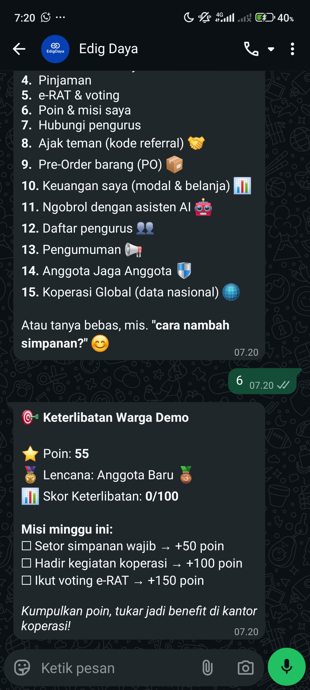<br><b>6 · Poin & Misi</b><br>Gamifikasi keterlibatan: total poin, lencana, skor /100, & <b>misi mingguan</b> (setor +50, hadir kegiatan +100, ikut voting +150).</td>
<td width="33%" valign="top">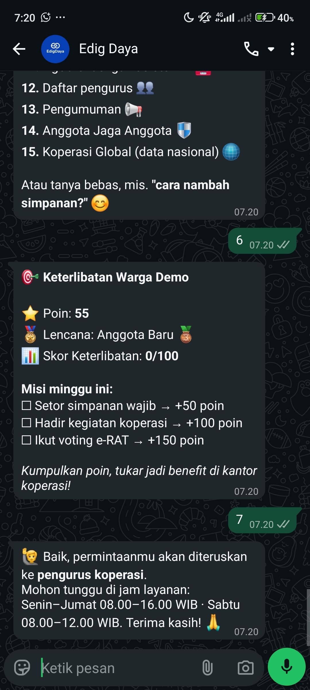<br><b>7 · Hubungi Pengurus</b><br>Meneruskan permintaan ke pengurus koperasi + info jam layanan (Senin–Jumat & Sabtu).</td>
<td width="33%" valign="top">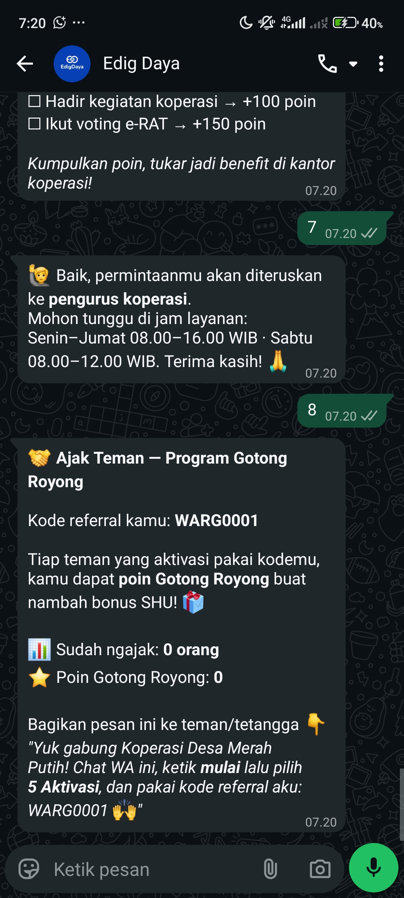<br><b>8 · Ajak Teman (Gotong Royong)</b><br>Program referral: kode ajakan (<code>WARG0001</code>) + poin bonus SHU tiap teman aktivasi. Ada pesan siap-bagikan.</td>
</tr>
<tr>
<td width="33%" valign="top">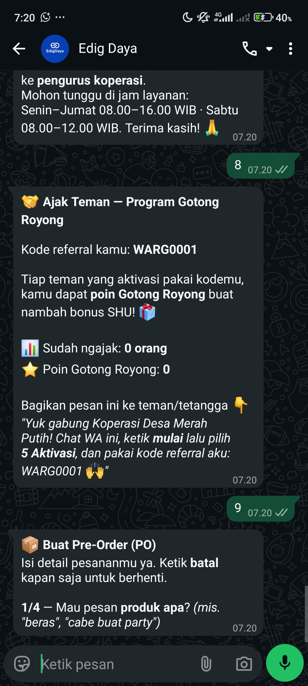<br><b>9 · Pre-Order (Form)</b><br>Form pemesanan barang bertahap (produk → jumlah → catatan → kapan butuh). Ketik <code>batal</code> kapan saja.</td>
<td width="33%" valign="top">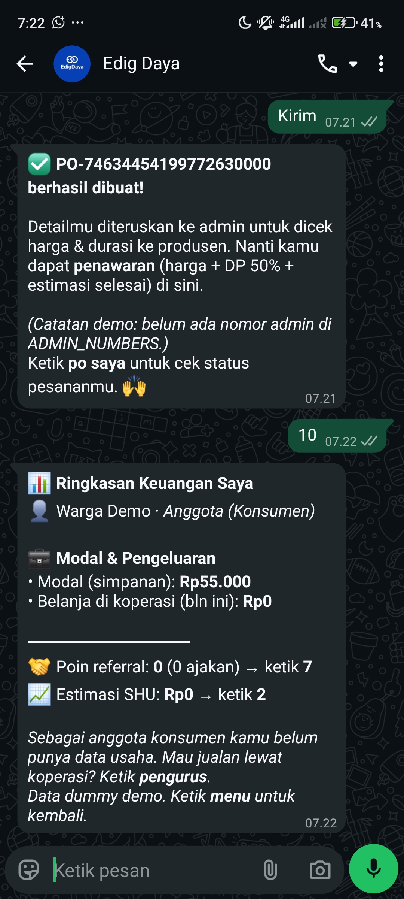<br><b>10 · Keuangan Saya</b><br>Ringkasan modal (simpanan) & belanja di koperasi, poin referral, & estimasi SHU dalam satu layar.</td>
<td width="33%" valign="top">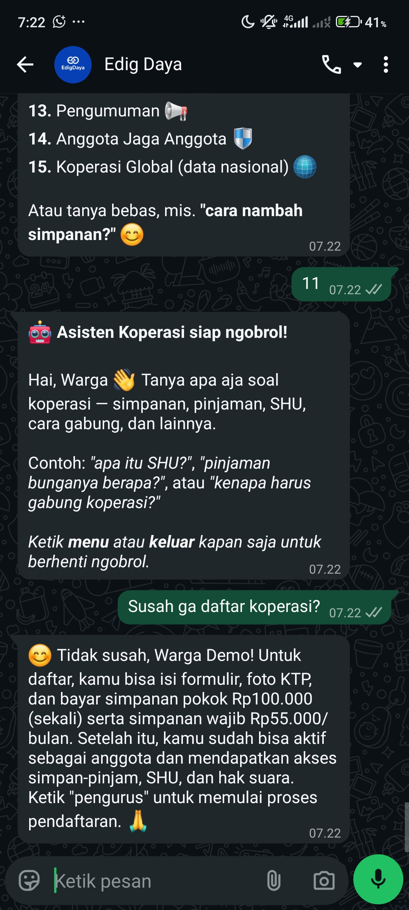<br><b>11 · Ngobrol dengan AI</b><br>Asisten AI menjawab pertanyaan bebas anggota (mis. <i>"susah ga daftar koperasi?"</i>) dengan konteks koperasinya.</td>
</tr>
<tr>
<td width="33%" valign="top">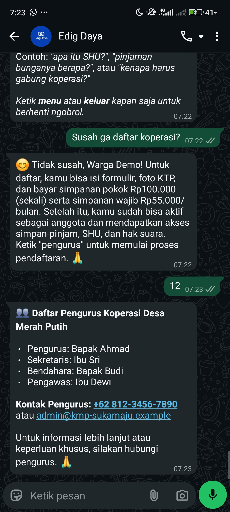<br><b>12 · Daftar Pengurus</b><br>Susunan pengurus (Pengurus, Sekretaris, Bendahara, Pengawas) + kontak resmi.</td>
<td width="33%" valign="top">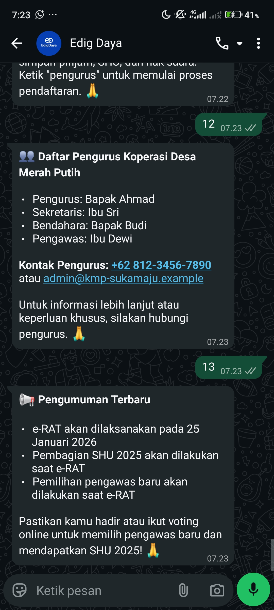<br><b>13 · Pengumuman</b><br>Kabar terbaru koperasi (jadwal e-RAT, pembagian SHU 2025, pemilihan pengawas baru).</td>
<td width="33%" valign="top">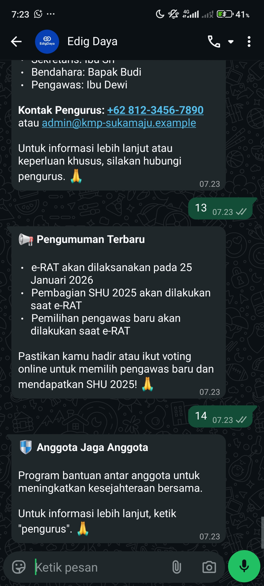<br><b>14 · Anggota Jaga Anggota</b><br>Program bantuan antar anggota untuk kesejahteraan bersama (mis. lapor kejanggalan).</td>
</tr>
<tr>
<td width="33%" valign="top">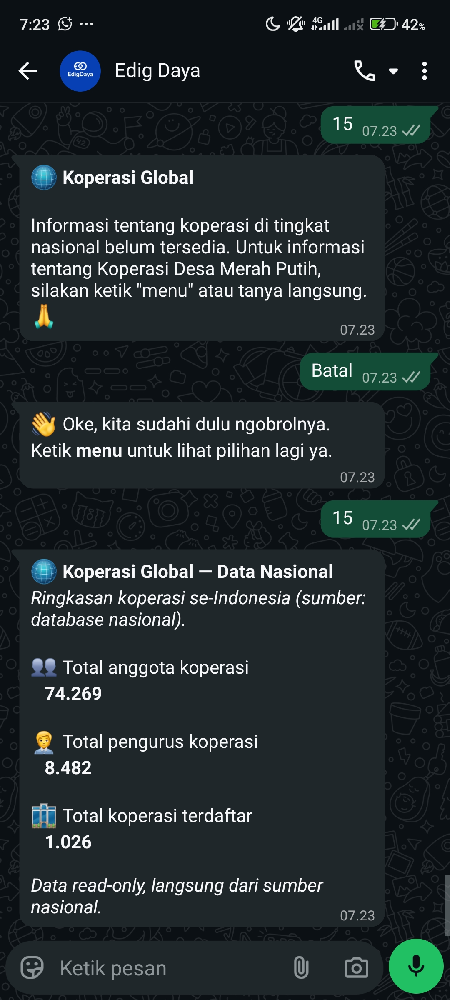<br><b>15 · Koperasi Global</b><br>Statistik koperasi <b>se-Indonesia</b> dari database nasional (<b>read-only</b>): total anggota, pengurus, & koperasi terdaftar.</td>
<td width="33%" valign="top"></td>
<td width="33%" valign="top"></td>
</tr>
</table>

### F. Alur Transaksi & Aksi

<table>
<tr>
<td width="300" valign="top">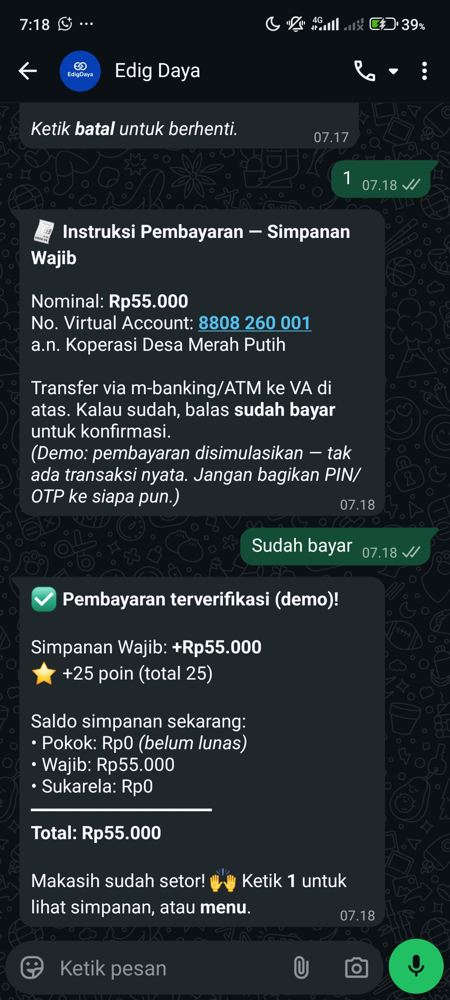</td>
<td valign="top">

**💳 Setor Simpanan**

- Ketik `setor` → pilih jenis (wajib / sukarela / pokok).
- Bot memberi **instruksi pembayaran**: nominal + **Nomor Virtual Account** atas nama koperasi.
- Setelah transfer, balas **`sudah bayar`** → **terverifikasi** (simulasi), saldo diperbarui, **+25 poin**.
- ⚠️ *Demo: pembayaran disimulasikan, tanpa transaksi nyata. PIN/OTP tidak pernah diminta.*

</td>
</tr>
<tr>
<td width="300" valign="top">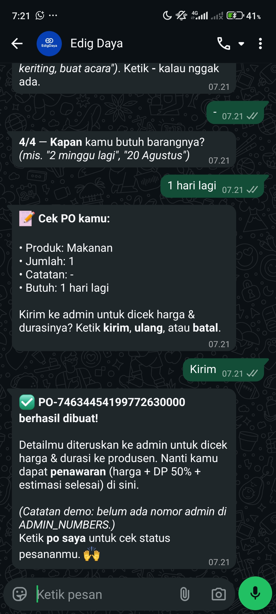</td>
<td valign="top">

**📦 Pre-Order → Kirim ke Admin**

- Setelah form terisi, bot menampilkan **ringkasan PO** (produk, jumlah, catatan, kebutuhan waktu).
- Balas **`kirim`** → PO dibuat dengan **nomor PO** & diteruskan ke admin untuk dicek harga & durasi ke produsen.
- Anggota nanti menerima **penawaran** (harga + **DP 50%** + estimasi selesai) dan bisa `setuju`/`batal`.
- Cek status kapan saja: `po saya`.

</td>
</tr>
</table>

### G. Fitur Suara (Voice Note → Aksi)

Fitur pembeda untuk **inklusi digital**: anggota yang enggan/kesulitan mengetik cukup **kirim pesan suara**. Bot mentranskripsi (Google STT, Bahasa Indonesia, dengan *boosting* kosakata koperasi) lalu **menindaklanjuti seperti pesan teks biasa**.

<table>
<tr>
<td width="300" valign="top">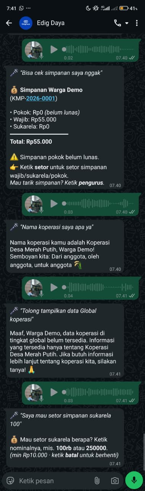</td>
<td valign="top">

**Contoh dari layar (semua diucapkan, bukan diketik):**

- 🎤 *"Bisa cek simpanan saya nggak"* → membuka **Simpanan Saya**.
- 🎤 *"Nama koperasi saya apa ya"* → menjawab **nama & semboyan** koperasi.
- 🎤 *"Tolong tampilkan data global koperasi"* → membuka **Koperasi Global**.
- 🎤 *"Saya mau setor simpanan sukarela 100"* → memulai **alur setor sukarela**.

> Audio hanya dipakai untuk transkrip, lalu **dibuang** (tidak disimpan/di-log) — OWASP & UU PDP.

</td>
</tr>
</table>

---

## 🚀 Instalasi & Menjalankan

**Prasyarat:** [Bun](https://bun.sh) `>=1.2` dan sebuah nomor WhatsApp untuk bot.

```bash
# 1. Clone & masuk folder
git clone https://github.com/ecodigitus/edigkop.git
cd edigkop

# 2. Pasang dependencies
bun install

# 3. Siapkan konfigurasi
cp .env.example .env
#   lalu isi .env seperlunya (lihat bagian Konfigurasi)

# 4. Jalankan
bun run dev      # mode development (auto-reload)
# atau
bun start        # jalan sekali (produksi)

# Cek tipe (opsional)
bun run typecheck
```

**Login WhatsApp:** saat pertama dijalankan, sebuah **QR code** muncul di terminal → buka **WhatsApp → Perangkat Tertaut → Tautkan perangkat** → scan. Sesi tersimpan di folder `auth/` sehingga **tidak perlu scan ulang** saat restart.

> 💡 **Mode tanpa AI:** bila API key AI dikosongkan, bot tetap jalan dalam **mode rule-based (menu) saja** — aman untuk uji cepat. Begitu juga DB: bila kredensial DB kosong, bot pakai **data dummy in-memory**.

**Ganti provider AI saat runtime** (lewat chat, tanpa restart): `ganti model groq` · `ganti model claude` · `ganti model gemini` · `ganti model vertex` · `model apa` (lihat provider aktif). Bila provider utama gagal (mis. kuota habis), bot **otomatis fallback ke Groq**.

---

## 🔧 Konfigurasi (.env)

Semua nilai sensitif diambil dari environment variable — **tidak ada secret di-hardcode**. Salin dari [`.env.example`](apps/bot/.env.example). Ringkasan yang penting:

| Variabel | Default | Keterangan |
|---|---|---|
| `AI_PROVIDER` | `groq` | `groq` · `anthropic` · `gemini` · `vertex` |
| `GROQ_API_KEY` | *(kosong)* | Key Groq (gratis di [console.groq.com](https://console.groq.com/keys)). Kosong → AI nonaktif |
| `GROQ_MODEL` | `llama-3.3-70b-versatile` | Model Groq |
| `ANTHROPIC_API_KEY` / `ANTHROPIC_MODEL` | *(kosong)* / `claude-opus-4-8` | Untuk provider `anthropic` |
| `GEMINI_API_KEY` / `GEMINI_MODEL` | *(kosong)* / `gemini-2.0-flash` | Untuk provider `gemini` (API key) |
| `VERTEX_SA_KEY_FILE` / `VERTEX_PROJECT_ID` / `VERTEX_MODEL` | *(kosong)* / — / `gemini-2.0-flash` | Untuk provider `vertex` (service account, pakai credit GCP) |
| `GCP_STT_API_KEY` / `GCP_STT_LANG` | *(kosong)* / `id-ID` | Speech-to-Text (voice note). Kosong → fitur suara nonaktif |
| `GCP_VISION_API_KEY` | *(kosong)* | Cloud Vision (OCR KTP). Kosong → fitur KTP nonaktif |
| `CLOUDSQL_HOST` / `CLOUDSQL_DB` / `CLOUDSQL_USER` / `CLOUDSQL_PASSWORD` | *(kosong)* | DB bot (PostgreSQL). Kosong → data dummy in-memory |
| `DB_TABLE_PREFIX` | *(kosong)* | Prefix nama tabel tim (mis. `edig_dev_`) |
| `SUPABASE_URL` / `SUPABASE_SERVICE_ROLE_KEY` | *(kosong)* | DB dashboard (server-side, **jangan** taruh di frontend) |
| `DB_HOST` / `DB_DATABASE` / `DB_USERNAME` / `DB_PASSWORD` | *(kosong)* | DB nasional hackathon (**read-only**, menu Koperasi Global) |
| `SIMKOPDES_API_URL` / `SIMKOPDES_API_KEY` | *(kosong)* | Endpoint aktivasi. Kosong → adapter dummy |
| `WA_AUTH_DIR` / `WA_LOGO_PATH` / `WA_HANDLE_GROUPS` | `auth` / `assets/logo-kdmp.jpg` / `false` | Setelan WhatsApp |
| `ADMIN_NUMBERS` / `BROADCAST_TARGETS` | *(kosong)* | Nomor admin (boleh broadcast) & target broadcast |
| `MAX_INBOUND_CHARS` / `RATE_MAX_PER_MIN` | `2000` / `15` | Batas panjang pesan & rate limit (anti-abuse) |
| `HISTORY_TURNS` / `SESSION_TTL_MINUTES` | `6` / `60` | Riwayat ke AI & umur sesi |
| `LOG_LEVEL` / `BAILEYS_LOG_LEVEL` | `info` / `warn` | Level logging |

> 🔐 **Jangan commit** `.env`, folder `auth/`, atau file service account (`*-sa.json`). Semua sudah masuk [`.gitignore`](apps/bot/.gitignore).

---

## 🌐 Deploy 24/7

Untuk demo/pilot yang selalu online tanpa laptop menyala, jalankan di **Google Cloud Compute Engine (VM)** dengan `systemd` (auto-restart & nyala saat boot). Panduan lengkap ada di **[DEPLOY.md](apps/bot/DEPLOY.md)**.

Singkatnya: buat VM (`e2-small`, region Jakarta) → pasang Bun → `git clone` + `bun install` → isi `.env` → scan QR sekali → daftarkan service `systemd`. Bot hanya melakukan **koneksi keluar** (WA/API/DB) sehingga **tidak perlu membuka port masuk**.

---

## 📂 Struktur Proyek

```
edigkop/
├── src/                       # Kode bot (TypeScript, dijalankan Bun)
│   ├── index.ts               # Entry point (start bot, hydrate data, cleanup sesi)
│   ├── config.ts              # Konfigurasi terpusat dari .env (tanpa secret hardcoded)
│   ├── whatsapp.ts            # Koneksi & event Baileys
│   ├── router.ts              # Routing hybrid: menu → intent AI → chat
│   ├── welcome.ts             # Welcome card ("mulai")
│   ├── activation.ts          # Aktivasi (kilat / form 12 langkah)
│   ├── ktp.ts                 # OCR KTP (Cloud Vision)
│   ├── voice.ts               # Voice note → teks (Cloud Speech-to-Text)
│   ├── intent.ts              # Deteksi maksud kalimat bebas
│   ├── ai.ts / vertex.ts      # Integrasi AI (Groq/Claude/Gemini & Vertex)
│   ├── simpanan.ts            # Setor & saldo simpanan
│   ├── preorder.ts            # Pre-Order (form user + command admin)
│   ├── laporan.ts             # Anggota Jaga Anggota (laporan)
│   ├── pengumuman.ts          # Pengumuman
│   ├── pengurus.ts            # Daftar & hubungi pengurus
│   ├── referral.ts            # Program referral "Gotong Royong"
│   ├── koperasiglobal.ts      # Data koperasi nasional (read-only)
│   ├── members.ts / db.ts     # Data anggota & akses DB (Cloud SQL)
│   ├── session.ts             # State percakapan per user + TTL
│   └── ...                    # menu, format, logger, notifications, dll.
├── dashboard/                 # Dashboard web (React + Vite + Supabase)
├── supabase/ · cloudsql/      # Skema & SQL database
├── scripts/                   # Skrip uji (test-gemini, test-vertex)
├── docs/screenshots/          # Tangkapan layar (dipakai README ini)
├── assets/                    # Logo, dsb.
├── COMMANDS.md                # Daftar lengkap semua perintah chat
├── DEPLOY.md                  # Panduan deploy 24/7 di GCP
├── extras/STACK.md            # Rincian tech stack
└── .env.example               # Contoh konfigurasi
```

---

## 🔒 Keamanan (OWASP & UU PDP)

Keamanan dirancang sejak awal, mengacu pada praktik **OWASP** dan **UU PDP No. 27/2022**:

- **Secret management (OWASP A05)** — semua kredensial via env var, tidak ada yang di-hardcode. `.env`, `auth/`, & service account ter-*gitignore*.
- **Kontrol akses (OWASP A01)** — perintah admin (broadcast, kelola PO) dibatasi ke `ADMIN_NUMBERS`; anggota hanya bisa mengelola data miliknya sendiri.
- **Anti-abuse** — rate limiting per menit (`RATE_MAX_PER_MIN`) & batas panjang pesan masuk (`MAX_INBOUND_CHARS`).
- **Anti-SSRF & resource exhaustion** — panggilan AI/eksternal ke endpoint tetap (bukan dari input user) + **timeout**; detail error API tidak dibocorkan ke user.
- **Prompt injection** — input user diperlakukan **tidak terpercaya**; aturan bot hanya di system prompt.
- **Perlindungan data pribadi (UU PDP)** — **password tidak pernah diminta lewat chat**; data form pendaftaran **tidak di-log** (tidak masuk history AI/logger, NIK di-mask); **foto KTP & audio voice note tidak disimpan** (dipakai lalu dibuang); persetujuan **Domisili + PDP wajib** sebelum submit.
- **Read-only** untuk data nasional (menu Koperasi Global) — hanya `SELECT`.
- **Fail-safe** — bila komponen eksternal (AI/DB/STT/OCR) tidak dikonfigurasi, fitur terkait **mati dengan aman** dan bot tetap berjalan.

---

## 📚 Dokumentasi Lain

| Dokumen | Isi |
|---|---|
| **[COMMANDS.md](apps/bot/COMMANDS.md)** | Daftar **lengkap semua perintah** chat (per peran: calon anggota, anggota, admin, demo) |
| **[DEPLOY.md](apps/bot/DEPLOY.md)** | Panduan deploy bot **24/7** di Google Cloud VM (systemd) |
| **[extras/STACK.md](apps/bot/extras/STACK.md)** | Rincian **tech stack**, dependency, & env var |
| **[PANDUAN-SUPABASE.md](apps/bot/PANDUAN-SUPABASE.md)** | Setup database Supabase (dashboard) |
| **[dashboard/](apps/dashboard/)** | Aplikasi **dashboard web** (React + Vite) |

---

## ⚠️ Catatan / Disclaimer

- Ini adalah **MVP untuk Hackathon**. Data anggota, nomor anggota, saldo, dan pembayaran bersifat **dummy/simulasi** — **tidak ada transaksi keuangan nyata**.
- Integrasi produksi (SIMKOPDES, DB koperasi, gateway pembayaran) dirancang **plug-in lewat konfigurasi** tanpa mengubah alur percakapan.
- Bot memakai **Baileys (WhatsApp Web)** — bukan WhatsApp Business API resmi. Gunakan sesuai kebijakan WhatsApp & untuk keperluan yang sah.
- Ketik **`reset`** kapan saja untuk mengembalikan nomor menjadi calon anggota (mengulang alur demo dari awal, non-destruktif).

<div align="center">

Dibuat dengan ❤️ untuk **Koperasi Desa Merah Putih** · **Edig Daya / Ecodigitus**

</div>
